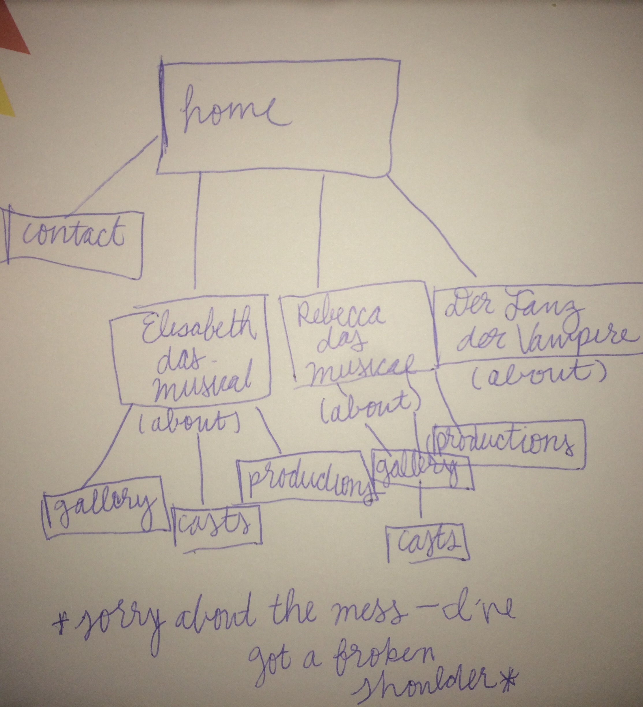
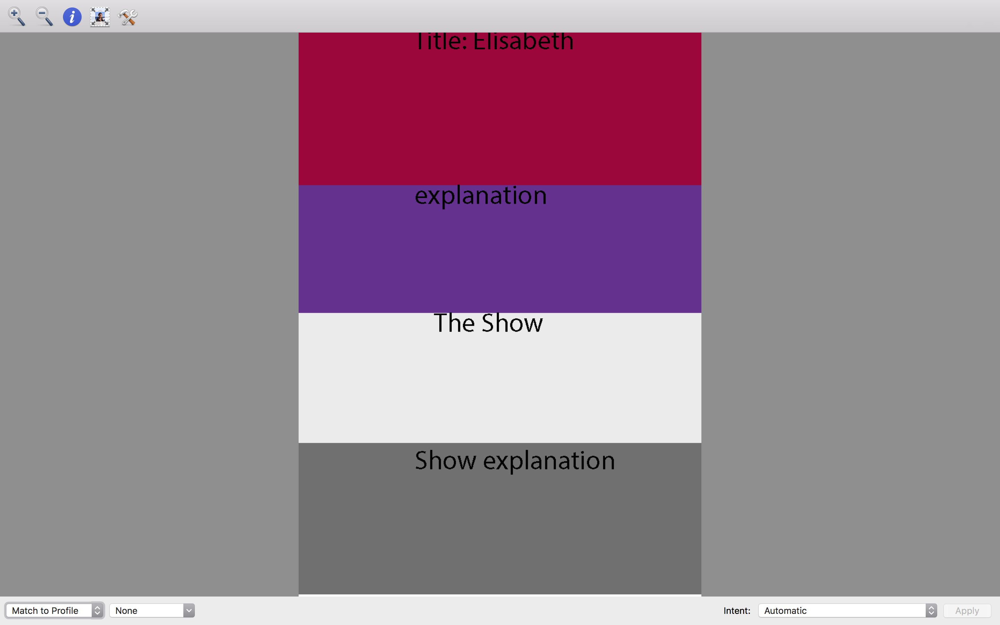
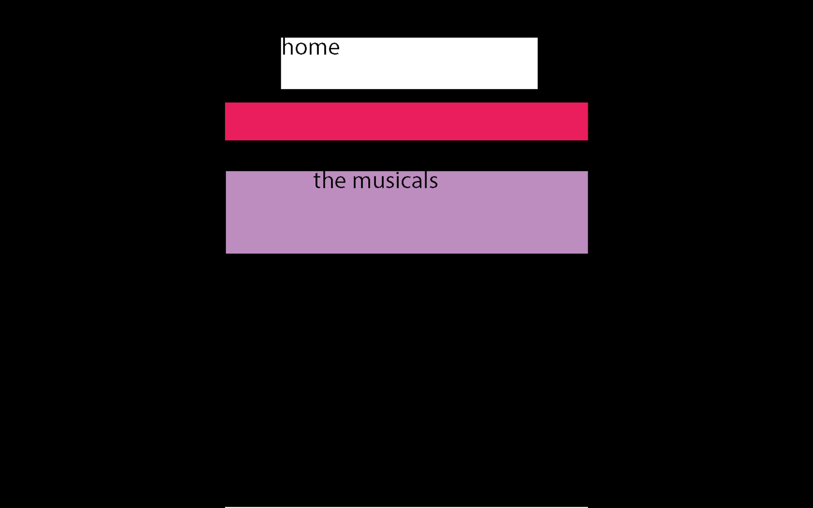

## Final Project Readme
### Victoria Lassettre
# 4 May 2017
## Topic
- For this project I am choosing to create a fan page for three of my favorite European musicals: Elisabeth das Musical, Rebecca das Musical, and Der Tanz der Vampire. For each of the musicals I will be including an about page that includes who created the show and what the synopsis of the show is. Additionally, there will be links to a gallery for each of the three shows, a link to the original cast and who is in the most recent/current cast, and the last link will show where there have been productions and include at least one video from the production.

## Site Map

- I am so very sorry that the handwriting is messy--broke my shoulder!

# Update 8 May 2017

##Stylin'
- For the main pages of the musicals I will be utilizing parallax, the remaining pages (the cast pages, galleries, home, and contact) will be relatively simple. They will be stylized with color, imbedded videos, and links.

Wire frames:
- Elisabeth das Musical:

- Rebecca das Musical:

- Home:

