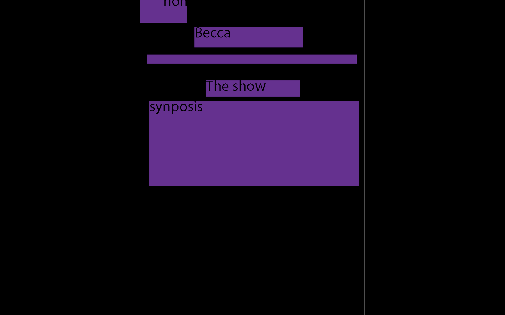
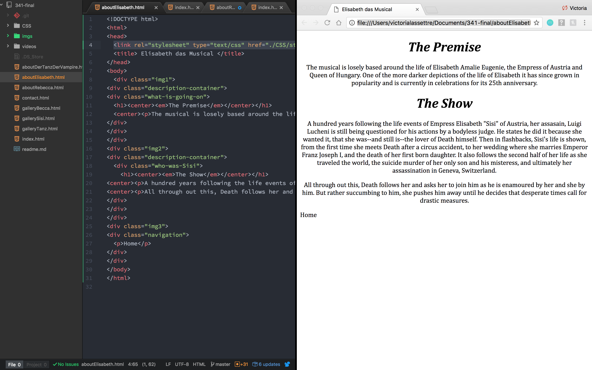
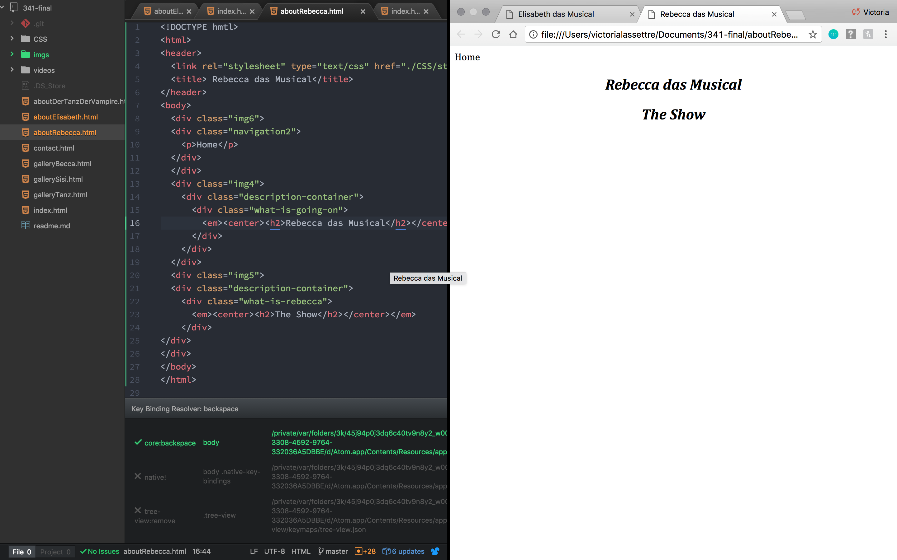
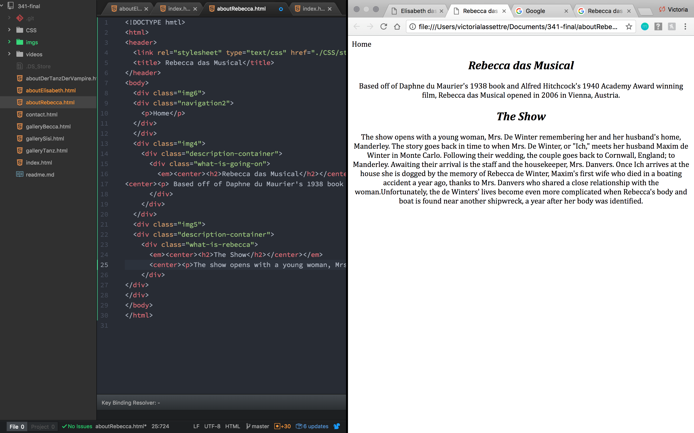

## Final Project Readme
### Victoria Lassettre
# 4 May 2017
## Topic
- For this project I am choosing to create a fan page for three of my favorite European musicals: Elisabeth das Musical, Rebecca das Musical, and Der Tanz der Vampire. For each of the musicals I will be including an about page that includes who created the show and what the synopsis of the show is. Additionally, there will be links to a gallery for each of the three shows, a link to the original cast and who is in the most recent/current cast, and the last link will show where there have been productions and include at least one video from the production.

## Site Map

- I am so very sorry that the handwriting is messy--broke my shoulder!

# Update 8 May 2017

##Stylin'
- For the main pages of the musicals I will be utilizing parallax, the remaining pages (the cast pages, galleries, home, and contact) will be relatively simple. They will be stylized with color, imbedded videos, and links.

Wire frames:
- Elisabeth das Musical:

- Rebecca das Musical:

- Home:

# Update 11 May 2017
- Finished the website!
- One problem that I faced was the parallax, it wasn't cooporating for the longest time and for some reason couldn't get it to work on the Elisabeth das Musical page for one of the images.
- In the future I'd like to come back to this project and update it further with photos, videos, and more cast lists.
- Right now it is only working on Safari.

## Some code images
- 
- 
- 
